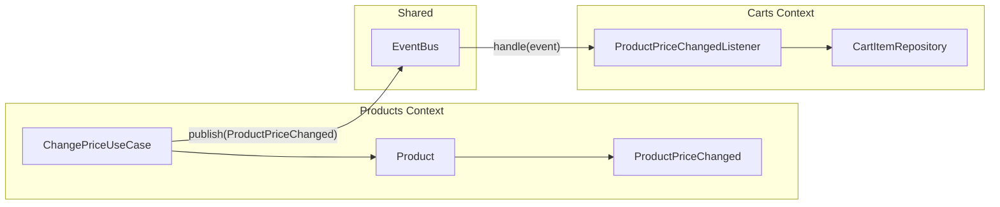
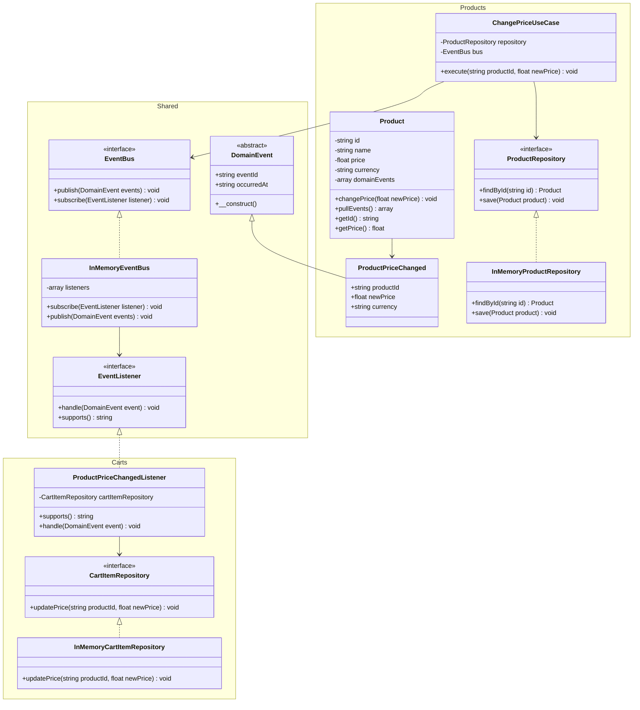

# Event Bus PHP Architecture

A pure PHP implementation of an Event Bus, demonstrating decoupled communication between Bounded Contexts via domain events.

## Concept

The Event Bus allows independent modules to communicate without knowing each other directly. One context publishes an event, another receives it with no coupling between the two.

## Quick Demo

```bash
composer install
php run.php
```

```php
$bus = new InMemoryEventBus();

$bus->subscribe(new ProductPriceChangedListener(
    cartItemRepository: new InMemoryCartItemRepository(),
));

$changePriceUseCase = new ChangePriceUseCase(
    new InMemoryProductRepository(),
    $bus,
);

$changePriceUseCase->execute('1', 100);
```

## Architecture

```
src/
├── Shared/Event/
│   ├── DomainEvent.php        # Abstract base class (eventId, occurredAt)
│   ├── EventBus.php           # Interface: publish/subscribe
│   ├── EventListener.php      # Interface: handle/supports
│   └── InMemoryEventBus.php   # In-memory implementation
│
├── Products/
│   ├── Domain/
│   │   ├── Product.php                    # Aggregate — emits events
│   │   ├── Events/ProductPriceChanged.php # Domain event
│   │   └── Repository/ProductRepository.php
│   ├── Application/UseCase/
│   │   └── ChangePriceUseCase.php         # Orchestrates business logic
│   └── Infrastructure/Repository/
│       └── InMemoryProductRepository.php
│
└── Carts/
    ├── Domain/Repository/CartItemRepository.php
    └── Infrastructure/
        ├── Listener/ProductPriceChangedListener.php  # Reacts to the event
        └── Repository/InMemoryCartItemRepository.php
```

## Diagrams

### Components



### Classes


